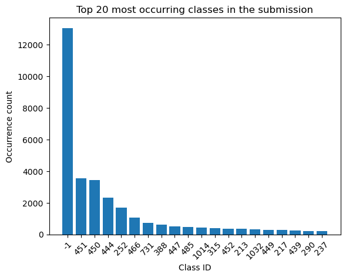
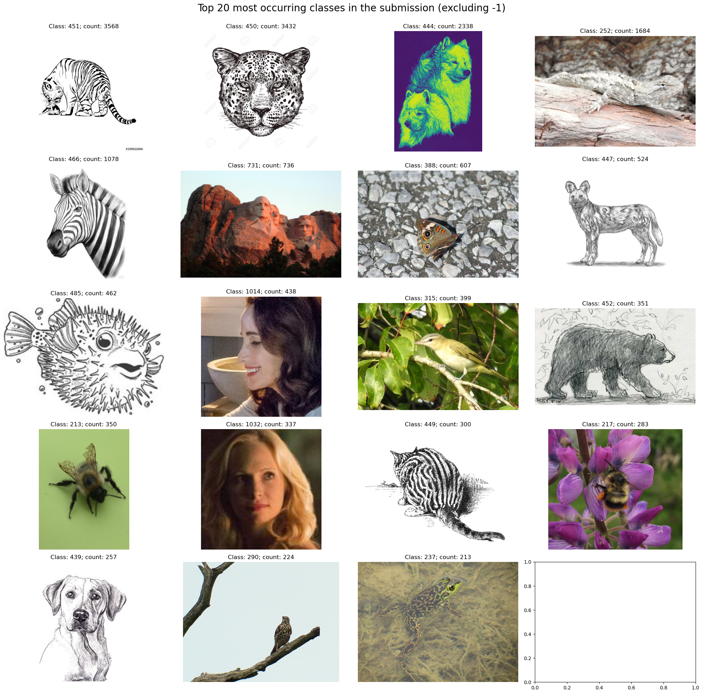
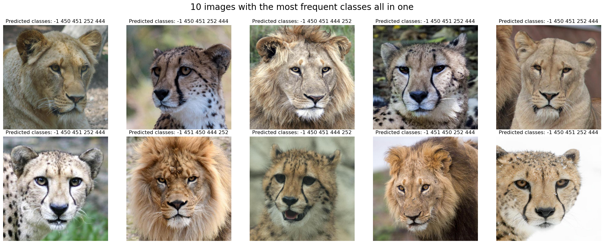
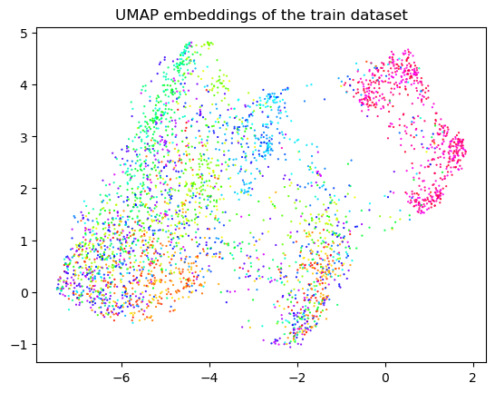
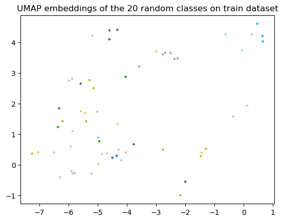
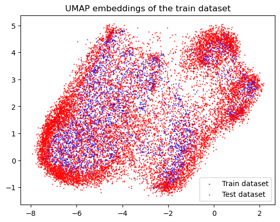

# Image retrieval with distractors

**by Andrii Shevtsov**

Repository of experiments for the [UCU Computer Vision 2024](https://www.kaggle.com/competitions/ucu-computer-vision-2024) Kaggle competition.

## Environment

We are using conda to manage the environment here. You can install it using the [guide](https://docs.anaconda.com/anaconda/install/index.html).

### Creating the environment

```bash
conda env create -f environment.yaml
```

### Updating the environment.yaml file (dev)

On Linux:

```bash
conda env export | grep -v "^prefix: " > environment.yaml
```

On Windows:

```bash
conda env export | findstr /V "^prefix: " > environment.yml
```

## Data

You can download data on this [Kaggle page](https://www.kaggle.com/competitions/ucu-computer-vision-2024/data) with "Download All" button and unzip it in the `data` directory here.

## Experiment log

### Supervised learning 1

Let's start with a typical supervised learning setup:
- Pretrained backbone based on ImageNet (for example resnet)
- Adaptive average pooling
- Linear layer from features count to the classes count as a head (possibly with dropout before it)

This model is then trained for multilabel inference: we use Binary Cross Entropy with logits, setting to 1 the class assigned to the image. During ingerence, we take a sigmoid of the result and obtain probabilities of each class being present on the image. We can then easily set a global threshold for the `-1` class, and add it at that place in corresponding place of the top.

For the best experiment in this setup, I used resnet50 as a backbone, cosine lr scheduler, starting lr 1e-3 and batch size of 64. It was trained for 30 epochs, until early stopping was triggered.

**VAL MAP@5**: 0.5486

**Submission with randomly guessed threshold (10%)**: 0.6433
**Submission using data leakage**: 0.7725

We can also make some clever threshold choice to maximize the result. For example, we can add 30% of outside images to the validation and find threshold that results in the biggest MAP@5 there.

Let's see what classes occur the most in the submission:



Let's also see several samples that predicted top classes in them and also samples of top classes from the train set to see how should that class look like:





As we see, top classes are related to big cats (tiger and the leopard), and all the images that are classified as those top classes are big cats. Still, we see that the lizard and those fluffy dogs are also quite a frequent choice for the model for lions, which is quite weird and means that we seem to undertrain. But it is OK for a supervised method for such a small amount of data for each class.

Let's also inspect the embeddings of the supervised model on train and test sets. To do this, we obtained embeddings after backbone, adaptive average pooling and flattening, and trained a UMAP on the train data embedding.

Here is the full train embeddings projected onto plane with UMAP (using colors to try to distinguish classes):



Here are 20 random classes' projections, and we can clearly see that samples for the same class are located approximately nearby, but still not too close:



Here are train samples along with test samples:



We can see that test samples are often "outside" of the locations of the train images, partially because of distractors and partially because the feature extractor wasn't the goal of this network (and this is still a projection of 2048-valued vectors to a 2D, so a lot of info is actually lost).
