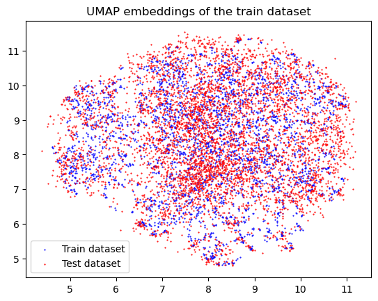

# Image retrieval with distractors

**by Andrii Shevtsov**

Repository of experiments for the [UCU Computer Vision 2024](https://www.kaggle.com/competitions/ucu-computer-vision-2024) Kaggle competition.

## Environment

We are using conda to manage the environment here. You can install it using the [guide](https://docs.anaconda.com/anaconda/install/index.html).

### Creating the environment

```bash
conda env create -f environment.yml
```

### Updating the environment.yaml file (dev)

On Linux:

```bash
conda env export | grep -v "^prefix: " > environment.yml
```

On Windows:

```bash
conda env export | findstr /V "^prefix: " > environment.yml
```

## Run main scripts

### Inference

```bash
python scripts/predict.py --checkpoint checkpoints/arcface_consistency_reg_1_1_resnet50_bs32_100epochs_cosinelr_lr1e-3_hardmargin_s30_m0.15_lambda100/epoch=23-step=2568.ckpt --train_config train_configs/arcface_consistency_reg.py --output submissions/arcface_consistency_reg_1_1_0_hardmargin_s30_m0.15_lambda100_thresh5.csv --distractor_threshold 0.05
```

or, to use leakage:

```bash
python scripts/predict.py --checkpoint checkpoints/arcface_consistency_reg_1_1_resnet50_bs32_100epochs_cosinelr_lr1e-3_hardmargin_s30_m0.15_lambda100/epoch=23-step=2568.ckpt --train_config train_configs/arcface_consistency_reg.py --output submissions/arcface_consistency_reg_1_1_0_hardmargin_s30_m0.15_lambda100.csv --use_512_leak
```

### Train

```bash
python scripts/train.py --config train_configs/arcface_consistency_reg.py
```

## Data

You can download data on this [Kaggle page](https://www.kaggle.com/competitions/ucu-computer-vision-2024/data) with "Download All" button and unzip it in the `data` directory here.

## Experiment log

### Supervised learning

Let's start with a typical supervised learning setup:
- Pretrained backbone based on ImageNet (for example resnet)
- Adaptive average pooling
- Linear layer from features count to the classes count as a head (possibly with dropout before it)

This model is then trained for multilabel inference: we use Binary Cross Entropy with logits, setting to 1 the class assigned to the image. During ingerence, we take a sigmoid of the result and obtain probabilities of each class being present on the image. We can then easily set a global threshold for the `-1` class, and add it at that place in corresponding place of the top.

For the best experiment in this setup, I used resnet50 as a backbone, cosine lr scheduler, starting lr 1e-3 and batch size of 64. It was trained for 30 epochs, until early stopping was triggered.

- **VAL MAP@5**: 0.5486
- **Submission with randomly guessed threshold (10%)**: 0.6433
- **Submission using data leakage**: 0.7725

We can also make some clever threshold choice to maximize the result. For example, we can add 30% of outside images to the validation and find threshold that results in the biggest MAP@5 there.

Let's see what classes occur the most in the submission:


Let's also see several samples that predicted top classes in them and also samples of top classes from the train set to see how should that class look like:


As we see, top classes are related to big cats (tiger and the leopard), and all the images that are classified as those top classes are big cats. Still, we see that the lizard and those fluffy dogs are also quite a frequent choice for the model for lions, which is quite weird and means that we seem to undertrain. But it is OK for a supervised method for such a small amount of data for each class.

Let's also inspect the embeddings of the supervised model on train and test sets. To do this, we obtained embeddings after backbone, adaptive average pooling and flattening, and trained a UMAP on the train data embedding.

Here is the full train embeddings projected onto plane with UMAP (using colors to try to distinguish classes):


Here are 20 random classes' projections, and we can clearly see that samples for the same class are located approximately nearby, but still not too close:


Here are train samples along with test samples:


We can see that test samples are often "outside" of the locations of the train images, partially because of distractors and partially because the feature extractor wasn't the goal of this network (and this is still a projection of 2048-valued vectors to a 2D, so a lot of info is actually lost).

### Metric learning

Here, I have decided to implement an **ArcFace** approach, as it is belived to be one of the most promising and efficient approaches. I have replaced a Linear layer from the previous approach with an ArcFace head (that stored classes angular centers as learnable embeddings and allowed for the model to learn with a common `CrossEntropyLoss`).

#### Attempt 1. Auxiliary head

Firstly, I used ArcFace as an additional head, that is used for training only to make embeddings "prettier", which was learned in parallel with a linear head with a `BCEWithLogitsLoss`. 

For the best experiment in this setup, I used resnet50 as a backbone, cosine lr scheduler, starting lr 1e-3 and batch size of 64. There was a 0.05 lambda (scale parameter) for an arcface loss part, leading to arcface loss mediocre decrease on validation. Margin between arcface classes were 0 (easy margin). It was trained for 40 epochs, until early stopping was triggered.

- **VAL MAP@5**: 0.5911
- **Submission with randomly guessed threshold (5%)**: 0.65878 (public), 0.66662 (private)
- **Submission using data leakage**: 0.78225 (public), 0.78827 (private)

Most occuring classes and typical images are almost the same here, except for several people occured in classes.

Embeddings here are quite similar to those obtained by the simple multiclass model:


Train losses were changing like this during training:


We can see that both losses were lowering. Head loss decreased almost immidiately to its great values, while arcface loss had that strange smooth spike on epochs 3 to 8, and starts lowering after then. I suppose, some consolidation of losses ocurred there.

At the same time, arcface loss for validation wasn't in fact lowering, suggesting low ArcFace head training and embedding learning state. However, as metrics were increasing constantly and futher then for the supervised model, I was happy.


#### Attempt 2. Standalone head

Previous results for arcface loss on validation suggested me to try to use just an arcface head alone for classification. 

The best model here occured with all the same, except for ArcFace parameters. Hypersphere radius ($s$) is 30 and a margin penalty ($m$) is 0.15. It was trained for 29 epochs until early stopping.

- **VAL MAP@5**: 0.636
- **Submission with randomly guessed threshold (5%)**: 0.66316 (public), 0.66129 (private)
- **Submission using data leakage**: 0.81531 (public), 0.81398 (private)

Even more people occured here in the top classes of the submission, however those are probably mostly false positives.

As for embeddings visualizations, here the same class is closer then before, and the overall space is less clusterized (due to the hypersphere, that arcface projects embeddings either way). Much more test samples are now in-distribution for train, and others are much closer than before. However, that still seems to be distinguishable.


Learning curves here are pretty smooth and straight in their growth:


### Semisupervised learning

For semisupervised learning, I have chosen a **consistency regularization** approach, as I was already familiar with pseudolabeling.

I used it in addition to an ArcFace approach, regularizing a combination of train and test weakly and strongly augmented images along with training it on a multilabel classification task. To do that, a combined loader was created:
```python
class CombinedLoader:
    def __init__(self, labeled_loader, unlabeled_loader):
        self.labeled_loader = labeled_loader
        self.unlabeled_loader = unlabeled_loader

    def __iter__(self):
        labeled_iter = iter(self.labeled_loader)
        unlabeled_iter = iter(self.unlabeled_loader)
        for labeled_batch, unlabeled_batch in zip(labeled_iter, unlabeled_iter):
            yield labeled_batch, unlabeled_batch

    def __len__(self):
        return min(len(self.labeled_loader), len(self.unlabeled_loader))
```

Train and test loaders with the same batch sizes were sampled on each step to preserve training balance. Validation was performed on hidden samples from train and test (for correct loss calculation), that emulated future testing on fully unknown samples. That leaded to performance jump without major val metrics increase.

For consistency regularization, `MSELoss` was used on probabilities for images pairs. Also, `KLDivLoss` was tried, but have led to nothing.

The best model obtained was once again a ResNet50 backbone, BS 32, lr=1e-3, cosine schedule, hard margin of ArcFace with sphere radius of 30 and margin coefficient of 0.15. Coefficient on consistency regularization loss was set to 100, as MSE on probabilities was becoming low really quick.

- **VAL MAP@5**: 0.68975
- **Submission with randomly guessed threshold (50%)**: 0.69102 (public), 0.69675 (private)
- **Submission using data leakage**: 0.81346 (public), 0.81634 (private)

Here, top 20 classes include even more people:


And, when taking top 10 images from the most frequent classes, they are all leopards, which is pretty interesting (probably it means the model is now more robust for leopards. But even if not, leopards are cool):


Train embeddings are even more compressed and dense for this setup (which is very natural):


But test embeddings again are partially out-of-distribution, and are much more widespread (compared with the arcface only). It is related to learning on those samples.


During training, consistency loss is rising almost all the time, however it would increase much more if we didn't use it during training:


### Unsupervised learning

I have chosen a **SimSiam** approach here, as it only uses positive pairs, that are obtained similary as in consistency regularization, is pretty stable to the batch size and an augmentations set, and is easy to implement.

The best unsupervised SimSiam model was trained with a ResNet50 backbone, lr 3e-3, batch size 64, embedding dimension of 1024 and projector dimension of 256. Negative cosine similarity was used as loss (as it should in the paper).

UMAPs of the train and test embeddings in the result are as follows:


As we see, embeddings are concentrated in several clusters, many classes are concentrated, but not as strongly as we would expect. Let's also see its learning curves:


So, the maximum obtained cosine similarity between augmented images is 0.96.

Now, there are two ways to use this model for test predictions:
- Vector KNN in an embedding space.
- Adding classification head, using SimSiam as a backbone.

#### Vector KNN Approach

Here, we use FAISS for a vector search. We choose the best distance among L1, L2 and IP (inner product, that is used only for normalized vectors) for each specific model, evaluated on a val subset of train. Predicted classes are 5 closest to the test sample. Distractor is set into the ordered list of classes in its place with a threshold distance. The threshold is searched as 90-th percentile of the distances distribution from the sample to the closest of its class on the validation set.

- **VAL MAP@5**: 0.206
- **Submission with chosen cosine similarity threshold (60%)**: 0.46916 (public), 0.47428 (private)
- **Submission using data leakage**: 0.51205 (public), 0.51712 (private)

60% wasn't a 90th percentile, however it was a reasonable number according to the histogram:


*0 on the histogram means that none of the same class have got into the first 100 most similar samples for the current one*

#### Training classification head

Here, we just used an MLP classification head for multilabel classification, and trained it with frozen SimSiam model as a backbone. An MLP as a head is a "long" one, consisting of three `Linear` layers with Batchnorms, Dropouts and ReLU activations along the way.

In the best setup, it was trained for 54 epochs with learning rate of 1e-3, cosine schedule with warmup (for half an epoch), batch size of 64. 

- **VAL MAP@5**: 0.1998
- **Submission with randomly chosen threshold (30%)**: 0.42524 (public), 0.43156 (private)
- **Submission using data leakage**: 0.5331 (public), 0.5375 (private)

We can see that it performs better than a pure cosine similarity search.

Learning curves for the MLP are:


We see that metrics are improving very slowly, and metrics increase slowers at the end.

### Pretrained-models only

Approach for the inference is the same as the Vector KNN approach described above. We have tried `dinov2-base` model from Facebook here.

We have chosen an L2 distance and a threshold of 2500:


It has resulted in:

- **VAL MAP@5**: 0.694
- **Submission with randomly chosen threshold (30%)**: 0.71199 (public), 0.71896 (private)
- **Submission using data leakage**: 0.81084 (public), 0.81443 (private)

### Combined approaches

Those are approaches combined multiple ideas from those learning methods and were mainly used to achieve high scores.

#### Arcface + consistency regularization + VIT CLIP

This one is almost the same as an ArcFace + consistency regularization, but uses `vit_huge_patch14_clip_224.laion2b_ft_in12k_in1k` as a backbone (the largest VIT CLIP from `timm` that fitted into the rented machine with an RTX 4090). Additionaly, we unfreezed last layers and updated them with a small learning rate to increase the quality of the final model. Finally, we used an MLP as head, the same way as for SimSiam's head.

The best model in this setup was trained for 27 epochs, with batch size 24, learning rate 5e-4, backbone learning rate 5e-6, backbone freezed before 26th VIT block (among 31), cosine scheduling with linear warmup for half an epoch, consistency reg loss coefficient of 300, and a standard set of ArcFace parameters used.

- **VAL MAP@5**: 0.8767
- **Submission with randomly chosen threshold (30%)**: 0.88162 (public), 0.88241 (private)
- **Submission using data leakage**: 0.93039 (public), 0.93313 (private)

It's learning curves are:


They look quite the same as for ArcFace + Consistency Regularization from the semi-supervised chapter, but better.

Embeddings trained by the method are much better (closer for one class and different for many classes) than all the previously trained models:




#### Arcface  + consistency regularization + VIT CLIP + LORA

Here, instead of fine-tuning the last layers of the VIT CLIP, we tried to fine-tune more layers using Low-Rank Adaptation algorithm. We concentrated on the linear layers inside the attention modules of VIT.

The best model was partially fine-tuned (after block 16), with rank and scaling parameter of 16, LoRa modules dropout probability of 0.1, head lr of 3e-4 and backbone (LoRa) lr of 3e-6, and batch size 8 due to CUDA memory restrictions. Rest of the parameters are the same as for the previous model.

- **VAL MAP@5**: 0.8944
- **Submission with randomly chosen threshold (10%)**: 0.87590 (public), 0.88450 (private)
- **Submission using data leakage**: 0.93456 (public), 0.94408 (private)

It's learning curves are:


And the embeddings:


They are hardly distinguishable from those above (in terms of classes compactness and interclass distances), but seem to be even more compact and better. A lot of test images are very concentrated, probably indicating distractors.

### Further to try

- Distractors search wasn't explored much in my work. 
    - The most basic way could be using probabilistic threshold, found by adding random images from the internet into the validation set in the desired proportion (~35%), and calculating a threshold that maximizes MAP@5 in this setup. 
    - The other one could base on a ROC curve, where we can find the threshold that is closest to left upper corner.
    - Clustering-based and metric-based approaches on embeddings also should be investigated.
- In consistency regularization, other consistency reg losses, and regularization of embeddings or logits instead of probabilities should be tried.
- Take the biggest CLIPs and DINOs possible and train MLP/ArcFace heads for them.
- Triplet-based metric learning with hard online triplet mining.
- Other un/self-supervised learning pretraining techniques, such as masked autoencoder or SimCLR, could be beneficial though compute-expensive.
